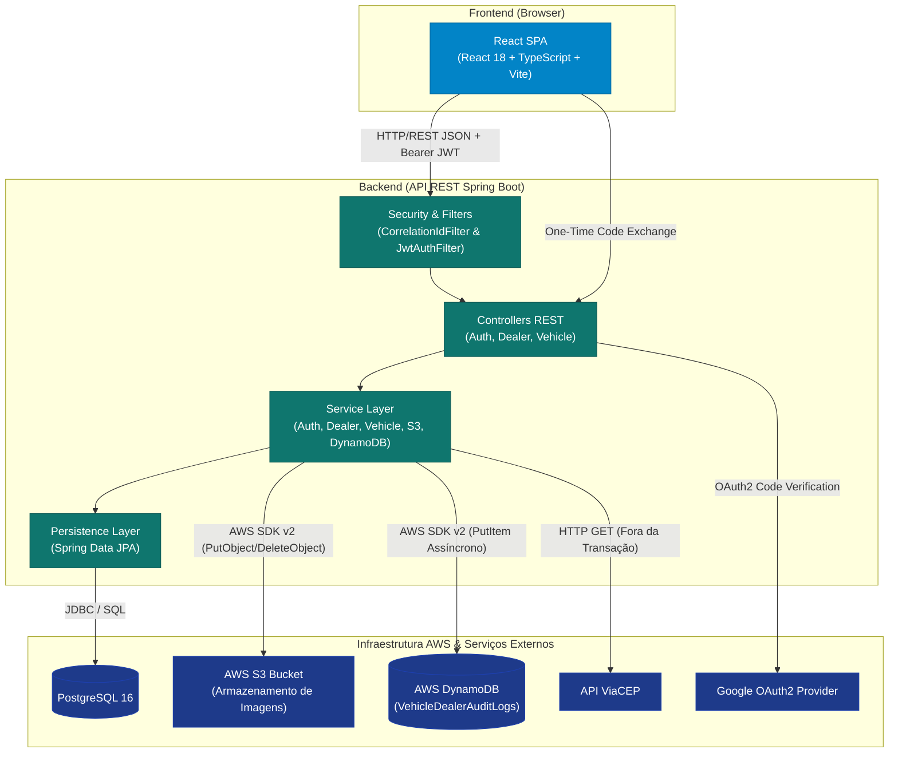
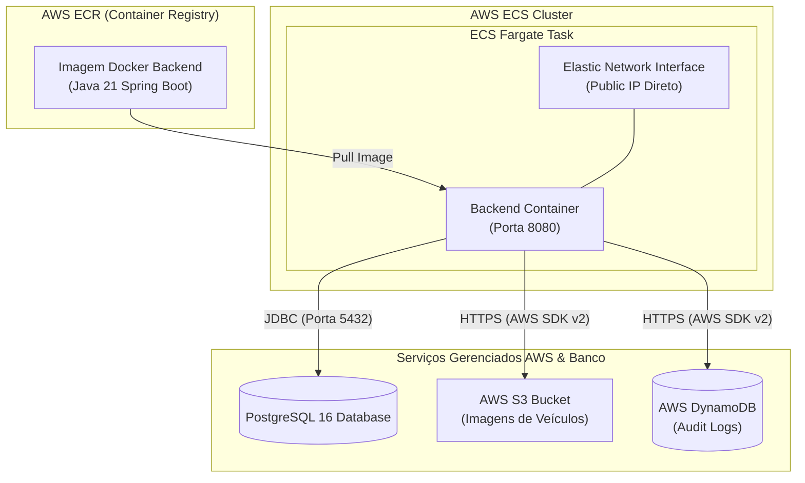
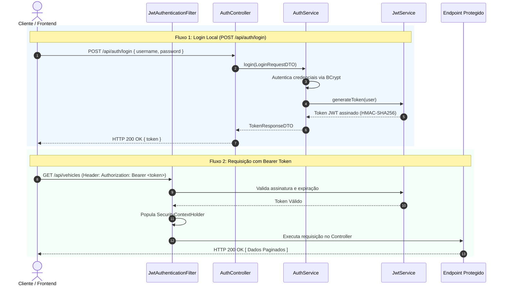
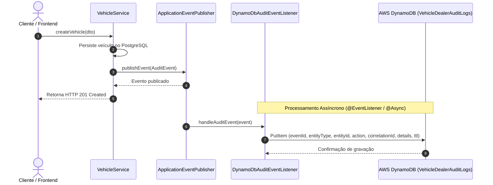

# Arquitetura da Solução

Documento de arquitetura técnica do Vehicle Dealer System, cobrindo a visão geral da solução, componentes frontend e backend, fluxos de autenticação, integração com serviços de nuvem AWS e decisões de projeto.

---

## Visão Geral da Solução

A aplicação adota uma arquitetura desacoplada composta por um Frontend Single Page Application (SPA) em React com TypeScript e uma API RESTful Backend em Java 21 com Spring Boot 3. A persistência relacional é gerenciada pelo PostgreSQL, enquanto imagens e logs de auditoria utilizam serviços nativos da AWS (S3 e DynamoDB).

---

## Arquitetura Frontend

O frontend foi desenvolvido focado em modularidade por domínio, validação rigorosa de formulários e gerenciamento assíncrono de estado.

- **React 18 & TypeScript**: Componentização declarativa com tipagem estática.
- **React Router v6**: Roteamento client-side com proteção de acesso via `ProtectedRoute`.
- **TanStack Query v5**: Gerenciamento de estado do servidor, cache automático, invalidação de queries e paginação com preservação de estado (`keepPreviousData`).
- **React Hook Form & Zod**: Controle de formulários e validação de schemas em tempo de digitação (formatos de placa, chassi VIN de 17 caracteres e valores monetários).
- **Axios**: Cliente HTTP configurado com interceptores para injeção automática de `Authorization: Bearer <token>` e `X-Correlation-Id`.

---

## Arquitetura Backend

O backend é estruturado em camadas para garantir forte separação de responsabilidades:

1. **Security & Interception Layer**:
   - `CorrelationIdFilter`: Injeta um UUID no MDC do SLF4J para rastreamento centralizado de logs através do cabeçalho `X-Correlation-Id`.
   - `JwtAuthenticationFilter`: Valida o token JWT HMAC-SHA256 recebido e popula o contexto de segurança (`SecurityContextHolder`).
2. **Controller Layer (`@RestController`)**: Expõe os endpoints RESTful, valida os payloads de entrada via `@Valid` e expõe os contratos da API no Swagger UI.
3. **Service Layer (`@Service`)**: Contém as regras de negócio do domínio (unicidade de placa e chassi, associação de concessionárias, validação de regras cadastrais).
4. **AWS Integration Layer (`@Service`)**:
   - `S3StorageService`: Gerencia uploads e remoções de imagens no AWS S3.
   - `DynamoDbAuditService`: Registra eventos operacionais na tabela `VehicleDealerAuditLogs` do AWS DynamoDB.
5. **Persistence Layer (`@Repository`)**: Acesso a dados via Spring Data JPA com suporte a paginação (`Pageable`) e ordenação.

---

## Arquitetura de Implantação AWS (ECS Fargate)

O ambiente de implantação da aplicação backend utiliza os serviços em nuvem da AWS:

### Decisões da Infraestrutura AWS
- **AWS ECS Fargate**: A aplicação backend é executada em modelo serverless de contêineres sobre o AWS ECS.
- **Endereçamento IP Público Direto**: A Task do ECS Fargate é provisionada com uma ENI exposta diretamente através de um IP público atribuído.
- **Simplificação de Arquitetura**: No escopo atual de implantação, a infraestrutura opera sem Application Load Balancer (ALB), sem distribuição via CloudFront, sem AWS Route 53 e sem certificados TLS em domínio próprio.

---

## Fluxos de Autenticação JWT e Google OAuth2

A autenticação é stateless baseada em JSON Web Tokens (JWT).

### Fluxo de Login Social com Google OAuth2
1. O usuário aciona o login social no frontend e é redirecionado para o endpoint de autorização do Spring Security.
2. Após o consentimento no Google, o backend processa o perfil retornado via `CustomOAuth2UserService`.
3. O `OAuth2AuthenticationSuccessHandler` gera um **One-Time Exchange Code** temporário (com TTL de 30 segundos) e redireciona a SPA para `/oauth2/redirect?code=XYZ`.
4. O frontend envia o código para `POST /api/auth/oauth2/exchange`, recebendo o token JWT final da aplicação.
5. Caso um e-mail retornado pelo Google coincida com uma conta local pré-existente sem vínculo explícito, o auto-linking direto é bloqueado para prevenção contra *Account Hijacking*, exigindo a vinculação autenticada via `/api/auth/oauth2/link`.

---

## Fluxo de Auditoria Assíncrona (AWS DynamoDB)

As operações de alteração de dados disparam eventos de auditoria processados assincronamente:

---

## Fluxo de Integração ViaCEP

Para a inclusão de concessionárias, o sistema realiza a busca automática de logradouros utilizando a API ViaCEP:

- **Execução Fora da Transação**: A chamada HTTP externa para `https://viacep.com.br/ws/{cep}/json/` é executada **antes** de abrir ou estender a transação bancária `@Transactional`. Isso garante que instabilidades na API externa não segurem conexões do pool HikariCP no PostgreSQL.
- **Mecanismo de Fallback**: Caso a API ViaCEP apresente timeout ou retorne erro, o sistema permite que o usuário informe os dados de logradouro, bairro, cidade e UF de forma manual.
