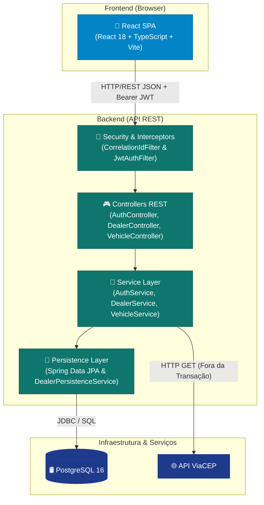
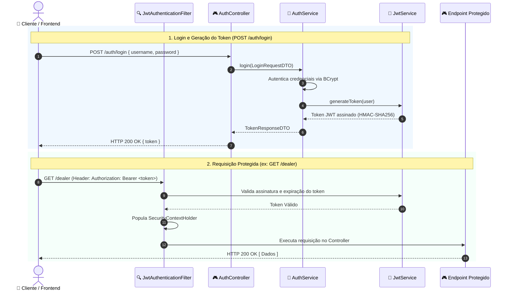
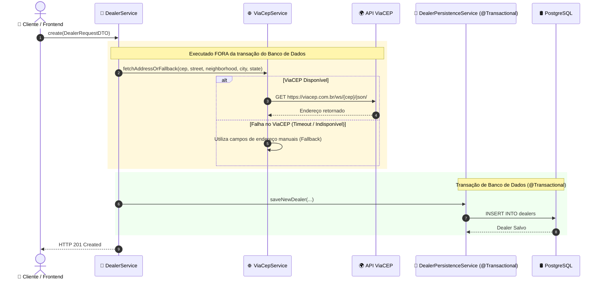

# Arquitetura da Solução

Documento de arquitetura técnica do **Vehicle Dealer System**, cobrindo a visão geral da solução, componentes frontend/backend, fluxos de autenticação, integração externa e principais decisões de design.

---

## 📌 Visão Geral da Solução

A aplicação adota uma arquitetura desacoplada em duas camadas principais: um **Frontend Single Page Application (SPA)** construído com React e TypeScript e um **Backend REST API** desenvolvido com Java 21 e Spring Boot 3.

---

## 💻 Arquitetura Frontend

O frontend foi desenvolvido com foco em modularidade, validação de formulários e gerenciamento eficiente de estado assíncrono.

* **React 18 + TypeScript**: Componentização com tipagem estática.
* **React Router**: Roteamento client-side com proteção de rotas privadas (`ProtectedRoute`).
* **TanStack Query (React Query)**: Cache de estado de servidor, paginação (`page`, `size`) e invalidação otimista de mutações.
* **React Hook Form + Zod**: Gerenciamento de formulários e validação de schemas em tempo de digitação (máscaras de CNPJ e CEP).
* **Axios**: Cliente HTTP configurado com interceptores para injeção automática do token JWT (`Authorization: Bearer`) e do header `X-Correlation-Id`.

---

## ⚙️ Arquitetura Backend

O backend é organizado em camadas bem definidas para garantir separação de responsabilidades:

1. **Security / Interception Layer**:
   - `CorrelationIdFilter`: Injeta um identificador único (`X-Correlation-Id`) no MDC do SLF4J para rastreamento de logs.
   - `JwtAuthenticationFilter`: Extrai, valida a assinatura HMAC-SHA256 do token JWT e popula o `SecurityContextHolder`.
2. **Controller Layer (`@RestController`)**: Expõe endpoints RESTful, valida payloads de entrada (`@Valid`) e documenta a API via OpenAPI 3.0 (Swagger UI).
3. **Service Layer (`@Service`)**: Executa as regras de negócio (validação de CNPJ, unicidade de placas e ordenação/paginação).
4. **Persistence Layer (`@Repository`)**: Acesso a dados via Spring Data JPA com suporte a paginação (`Pageable`) e filtros dinâmicos via `Specification`.

---

## 🔐 Fluxo de Autenticação JWT

A autenticação é inteiramente **stateless** baseada em JSON Web Tokens (JWT).

---

## 🌐 Fluxo de Integração ViaCEP

No cadastro de concessionárias, o endereço é buscado automaticamente via API ViaCEP.

### Principais Destaques da Integração ViaCEP
- **Proteção do Pool de Conexões (HikariCP)**: A chamada HTTP externa é feita **fora** do escopo `@Transactional`. Isso impede que latências de rede da API externa prendam conexões do banco de dados.
- **Resiliência via Fallback Manual**: Caso a API ViaCEP esteja indisponível ou o CEP seja inválido, o sistema aceita o preenchimento manual dos campos de logradouro, bairro, cidade e UF.

---

## 🎯 Principais Decisões Técnicas

1. **Uso do Padrão DTO**: Transferência de dados estritamente via registros imutáveis (`records` Java), mantendo as entidades JPA isoladas da camada REST.
2. **Tratamento Global de Exceções**: Centralizado via `@RestControllerAdvice` (`GlobalExceptionHandler`), padronizando retornos HTTP (`400`, `401`, `403`, `404`, `500`).
3. **Rastreabilidade com Correlation ID**: Injeção automática de um UUID no header `X-Correlation-Id` vinculado ao SLF4J MDC.
4. **Validação em Duas Etapas**: Validação sintática no cliente com Zod e validação semântica/algorítmica no servidor (ex: checksum de CNPJ).
