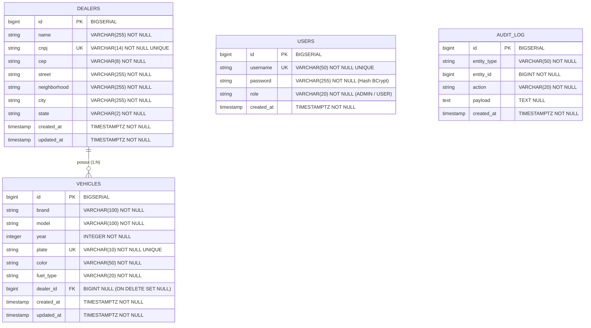

# Modelo de Dados & Schema Relacional

Este documento especifica a modelagem relacional de banco de dados do **Vehicle Dealer System**, incluindo o Diagrama Entidade-Relacionamento (ERD), definições de tabelas, índices e controle de migrações via Flyway.

---

## 🛢️ Diagrama Entidade-Relacionamento (ERD)

---

## 📋 Detalhamento das Entidades

### 1. `dealers` (Concessionárias)
* **Finalidade**: Armazena os dados cadastrais das concessionárias parceiras.
* **Chave Única (UK)**: `cnpj` (14 dígitos numéricos normalizados). Impede duplicidade de cadastros.
* **Endereço**: Campos (`cep`, `street`, `neighborhood`, `city`, `state`) integrados com ViaCEP ou via fallback manual.

### 2. `vehicles` (Veículos)
* **Finalidade**: Armazena o catálogo de veículos.
* **Chave Única (UK)**: `plate` (placa do veículo).
* **Validação de Combustível**: Constraint `chk_fuel_type` garante valores válidos (`GASOLINA`, `ETANOL`, `FLEX`, `DIESEL`, `ELETRICO`, `HIBRIDO`).
* **Relacionamento com Concessionária**: Chave estrangeira `dealer_id` aponta para `dealers(id)` com regra `ON DELETE SET NULL`. Se a concessionária for removida, o histórico de veículos permanece preservado no sistema com `dealer_id = NULL`.

### 3. `users` (Autenticação)
* **Finalidade**: Gerenciamento de credenciais de acesso do Spring Security.
* **Segurança**: Senhas armazenadas via hash BCrypt e autorizações via coluna `role` (`ADMIN` ou `USER`).

### 4. `audit_log` (Auditoria Operational)
* **Finalidade**: Registra o histórico de alterações (`CREATE`, `UPDATE`, `DELETE`) publicado de forma desacoplada via `ApplicationEventPublisher`.

---

## 🚀 Índices de Alta Performance

| Nome do Índice | Tabela Target | Coluna(s) | Propósito |
| :--- | :--- | :--- | :--- |
| `idx_dealers_cnpj` | `dealers` | `cnpj` | Otimização de consultas por CNPJ e validação de duplicidade. |
| `idx_vehicles_dealer_id` | `vehicles` | `dealer_id` | Aceleração de JOINs e consultas de veículos por concessionária. |
| `idx_audit_entity` | `audit_log` | `entity_type`, `entity_id` | Recuperação rápida do histórico de auditoria por entidade. |

---

## ⚙️ Migrações de Banco (Flyway)

O esquema do banco de dados é versionado sequencialmente via scripts Flyway localizados em `src/main/resources/db/migration/`:

1. `V1__initial_schema.sql`: Criação das tabelas `dealers`, `vehicles`, `audit_log`, Foreign Keys e Índices.
2. `V2__security_schema.sql`: Criação da tabela `users` e inserção do usuário `admin` padrão.
3. `V3__add_color_to_vehicles.sql`: Adição da coluna `color` na tabela `vehicles`.
