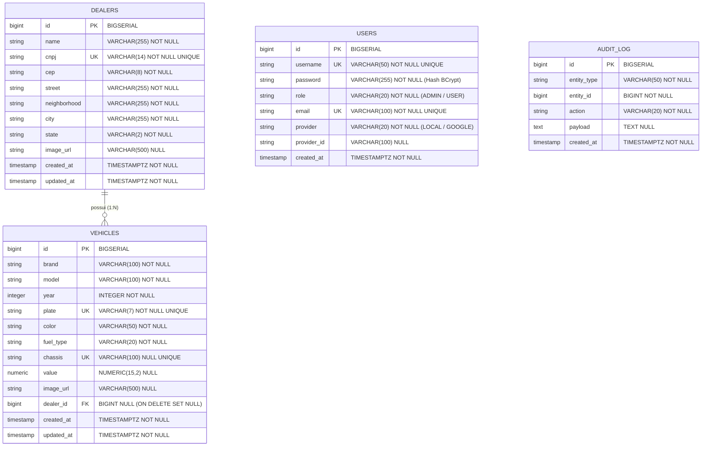

# Modelo de Dados & Schema Relacional

Este documento especifica a modelagem relacional de banco de dados do Vehicle Dealer System, incluindo o Diagrama Entidade-Relacionamento (ERD), definições de tabelas, índices de alta performance, migrações Flyway (V1 a V8) e a estrutura NoSQL da tabela de auditoria no AWS DynamoDB.

---

## Diagrama Entidade-Relacionamento (ERD)

---

## Detalhamento das Entidades Relacionais (PostgreSQL)

### 1. `dealers` (Concessionárias)
- **Propósito**: Armazena os dados cadastrais das concessionárias.
- **Chave Única (UK)**: `cnpj` (14 dígitos numéricos sanitizados). Impede duplicidades.
- **Campos de Endereço**: `cep`, `street`, `neighborhood`, `city`, `state` alimentados automaticamente via ViaCEP ou preenchidos manualmente via fallback.
- **Campo de Imagem**: `image_url` (VARCHAR 500) armazena o link da mídia no AWS S3.

### 2. `vehicles` (Veículos)
- **Propósito**: Armazena o catálogo de veículos cadastrados.
- **Chaves Únicas (UK)**:
  - `plate`: Placa do veículo (7 caracteres alfanuméricos formatados).
  - `chassis`: Código de Chassi VIN de 17 caracteres (restrição de unicidade aplicada via migração V8).
- **Valores e Atributos**:
  - `value`: Valor comercial armazenado como `NUMERIC(15,2)`.
  - `fuel_type`: Tipo de combustível (`GASOLINA`, `ETANOL`, `FLEX`, `DIESEL`, `ELETRICO`, `HIBRIDO`).
  - `image_url`: URL da imagem do veículo hospedada no AWS S3.
- **Relacionamento**: Chave estrangeira `dealer_id` referenciando `dealers(id)` com regra `ON DELETE SET NULL`. A exclusão de uma concessionária preserva os veículos no catálogo, desvinculando-os (`dealer_id = NULL`).

### 3. `users` (Autenticação e Usuários)
- **Propósito**: Gerenciamento de credenciais e identificadores para Spring Security e OAuth2.
- **Campos de Controle**:
  - `username`: Identificador único de acesso local.
  - `email`: Endereço de e-mail único.
  - `password`: Hash criptografado via BCrypt.
  - `role`: Perfil de acesso (`ADMIN` ou `USER`).
  - `provider`: Provedor de autenticação (`LOCAL` ou `GOOGLE`).
  - `provider_id`: ID do usuário retornado pelo provedor OAuth2 Google.

### 4. `audit_log` (Tabela Relacional Legada)
- **Propósito**: Tabela histórica inicial mantida no PostgreSQL para fins de compatibilidade. As operações de auditoria em produção são gravadas primariamente na tabela NoSQL AWS DynamoDB.

---

## Índices de Alta Performance

| Nome do Índice | Tabela Target | Colunas | Propósito |
|---|---|---|---|
| `idx_dealers_cnpj` | `dealers` | `cnpj` | Otimização de busca e validação de unicidade de CNPJ. |
| `idx_vehicles_dealer_id` | `vehicles` | `dealer_id` | Aceleração de JOINs e consultas de veículos por concessionária. |
| `idx_vehicles_brand_model_year` | `vehicles` | `brand`, `model`, `year` | Aceleração de filtros de busca combinada no catálogo. |
| `uk_vehicle_chassis` | `vehicles` | `chassis` | Garante a restrição de unicidade para o código de Chassi (V8). |
| `idx_audit_entity` | `audit_log` | `entity_type`, `entity_id` | Consultas na tabela de auditoria relacional. |

---

## Versionamento do Banco de Dados (Flyway Migrations)

O esquema relacional é gerenciado sequencialmente pelos scripts do Flyway em `backend/src/main/resources/db/migration/`:

1. **`V1__initial_schema.sql`**: Criação das tabelas `dealers`, `vehicles`, `audit_log`, índices de busca inicial e chaves estrangeiras.
2. **`V2__security_schema.sql`**: Criação da tabela `users` e estrutura de autenticação.
3. **`V3__remove_default_admin_seed.sql`**: Remoção da linha estática de usuário administrador originalmente inserida no seed de desenvolvimento.
4. **`V4__vehicle_search_indexes.sql`**: Adição do índice composto `idx_vehicles_brand_model_year` para otimização de consultas textuais.
5. **`V5__add_vehicle_and_dealer_image_url.sql`**: Inclusão da coluna `image_url` (VARCHAR 500) nas tabelas `vehicles` e `dealers`.
6. **`V6__add_vehicle_chassis_and_value.sql`**: Adição das colunas `chassis` (VARCHAR 100) e `value` (NUMERIC 15,2) na tabela `vehicles`.
7. **`V7__clean_blank_image_urls.sql`**: Execução de script DML para conversão de strings vazias de `image_url` em valores `NULL`.
8. **`V8__add_unique_constraint_to_vehicle_chassis.sql`**: Saneamento de registros duplicados e aplicação da restrição `UNIQUE` (`uk_vehicle_chassis`) na coluna `chassis`.

---

## Modelo de Auditoria NoSQL (AWS DynamoDB)

As operações de criação, atualização e exclusão disparam eventos de auditoria gravados na tabela NoSQL `VehicleDealerAuditLogs` no AWS DynamoDB.

### Estrutura dos Atributos da Tabela `VehicleDealerAuditLogs`

| Atributo | Tipo DynamoDB | Propósito |
|---|---|---|
| `eventId` | String (S) | **Partition Key (PK)**. Identificador UUID único do evento de auditoria. |
| `entityType` | String (S) | Tipo da entidade auditada (`VEHICLE`, `DEALER`, `USER`). |
| `entityId` | Number (N) | ID numérico do registro auditado. |
| `action` | String (S) | Ação executada (`CREATE`, `UPDATE`, `DELETE`). |
| `correlationId` | String (S) | Identificador de rastreabilidade HTTP MDC (`X-Correlation-Id`). |
| `timestamp` | String (S) | Timestamp da ocorrência no formato ISO-8601 UTC. |
| `details` | String (S) | Representação JSON dos dados alterados ou metadados da operação. |
| `ttl` | Number (N) | Epoch Unix Timestamp para expiração automática Time-To-Live (90 dias). |

### Política de Expiração (TTL)
A tabela possui o mecanismo de **Time-To-Live (TTL)** ativado no atributo `ttl`. Registros de auditoria com mais de 90 dias são removidos automaticamente pelo DynamoDB sem consumo de throughput ou custos adicionais de gravação.
