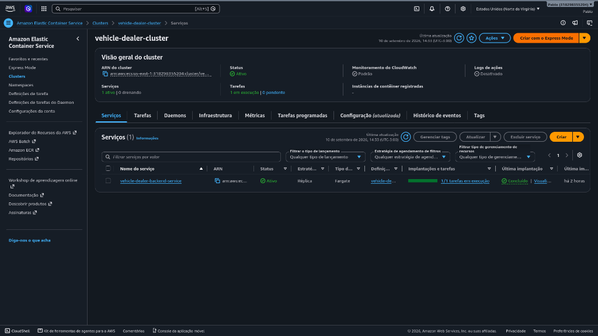
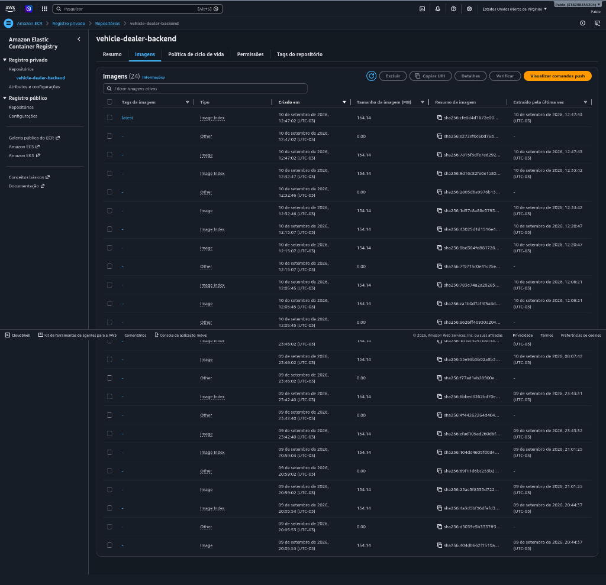
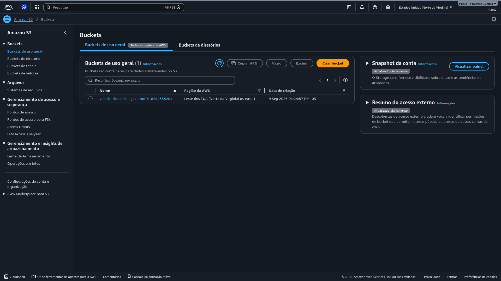
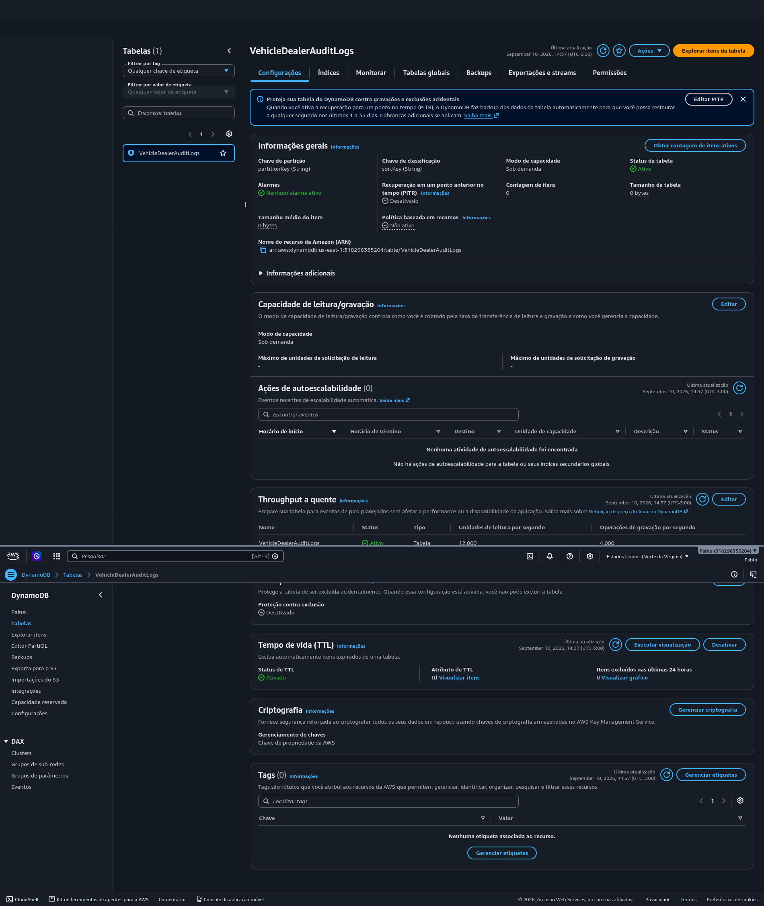
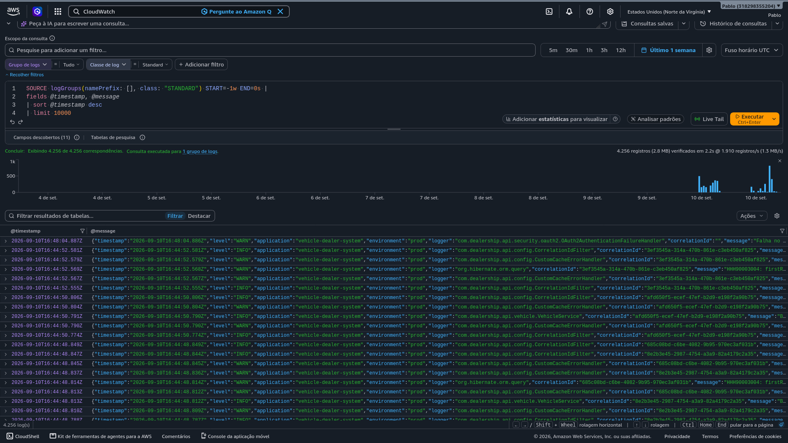

# ☁️ AWS Cloud Infrastructure & Deployment Guide

Este documento detalha a arquitetura em nuvem e a estratégia de implantação da aplicação **Vehicle Dealer System** na Amazon Web Services (AWS).

---

## 🏛️ Arquitetura AWS

```text
[ Vercel / Client SPA ]
       │
       ▼ (HTTPS / Reverse Proxy /api)
[ AWS ECS Fargate ] ──► [ Amazon ECR (Docker Registry) ]
       │
       ├──► [ Amazon RDS PostgreSQL ] (Persistência Relacional)
       ├──► [ Amazon ElastiCache / Redis ] (Cache de Alta Performance)
       ├──► [ Amazon S3 ] (Armazenamento de Mídia & Presigned URLs)
       ├──► [ Amazon DynamoDB ] (Logs de Auditoria NoSQL)
       └──► [ Amazon CloudWatch ] (Centralização de Logs & Métricas)
```

---

## 📸 Evidências do Console AWS

### 1. AWS ECS (Elastic Container Service - Fargate)

> Serviço ativo `vehicle-dealer-backend-service` em modo Fargate com status `ACTIVE` e tarefas em execução.

---

### 2. AWS ECR (Elastic Container Registry)

> Repositório de imagens Docker `vehicle-dealer-backend` com tags de versão (`latest`).

---

### 3. Amazon S3 Bucket

> Armazenamento de mídias e fotos de veículos servidas via Presigned URLs temporárias.

---

### 4. Amazon DynamoDB Audit Logs

> Tabela `VehicleDealerAuditLogs` gravando registros de auditoria com `correlationId` e retenção TTL.

---

### 5. Amazon CloudWatch Logs

> Coleta centralizada de logs do Spring Boot 3 via Log group `/ecs/vehicle-dealer-backend`.
